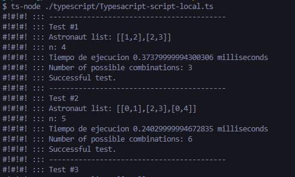

# Journey to moon in Typescript

## Files
* File [Typesacript-script-hackerank.ts](./Typesacript-script-hackerank.ts) for [Hackerrank](https://www.hackerrank.com/challenges/journey-to-the-moon/problem)
* File [Typesacript-script-local.ts](./Typesacript-script-local.ts) for local test

## Installation

Use the package manager [npm](https://www.npmjs.com/).

```bash
npm install -g typescript ts-node
```


## Usage

```bash
# /typecript/
ts-node ./typescript/Typesacript-script-local.ts
```

## Output

